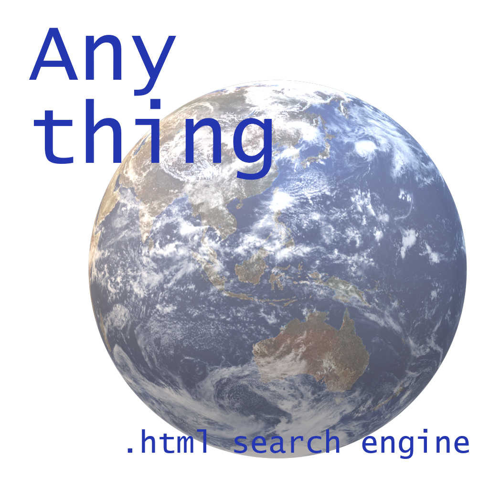

# Anything Search

A simple search engine made completely in one html file that can search trough a search engine of your liking like Google, Bing, DuckDuckGo, or even Yahoo!

# What is this?
This is a simple search engine made for quick and flawless search. It offers a minimalistic look and purpose.

# Why is it made?
Originally at school, there's a dream technology thing and the theme is future. So I thought of an app that could search from any other search engine, but all my friends thought of flying cars and more fantasy-like things. So I started designing the concept at canva and I of course named it "Anything", showed everyone the concept, the teacher liked it. Then 1 year later I learnt HTML and i knew I could recreate this app, so i started making it. Now we got this Anything Search thing.

# How to install?
Option 1 : Choose a version from the releases section, then install the html file, open it with any browser you want.
Option 2 : No need to install, just go to [the neocities website](https://anything-search.neocities.org/) officially hosted by me.
